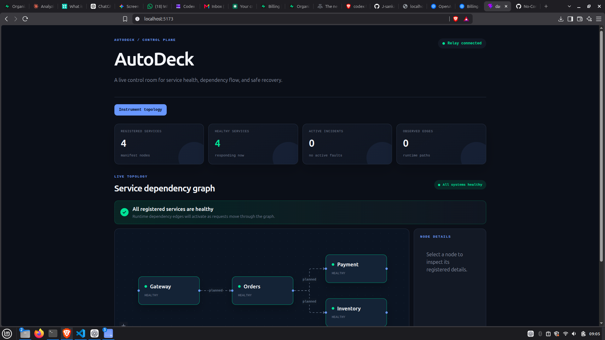
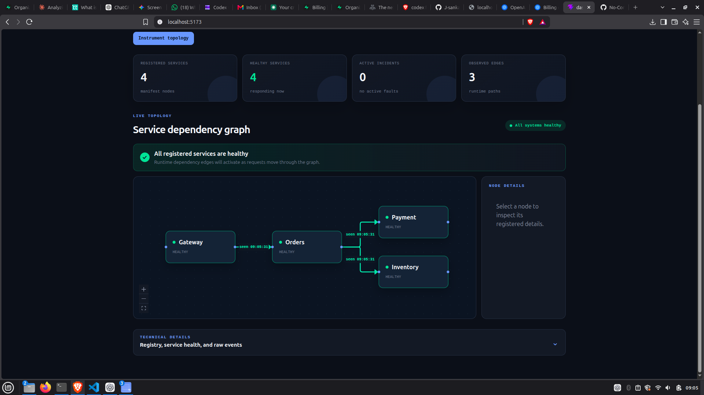
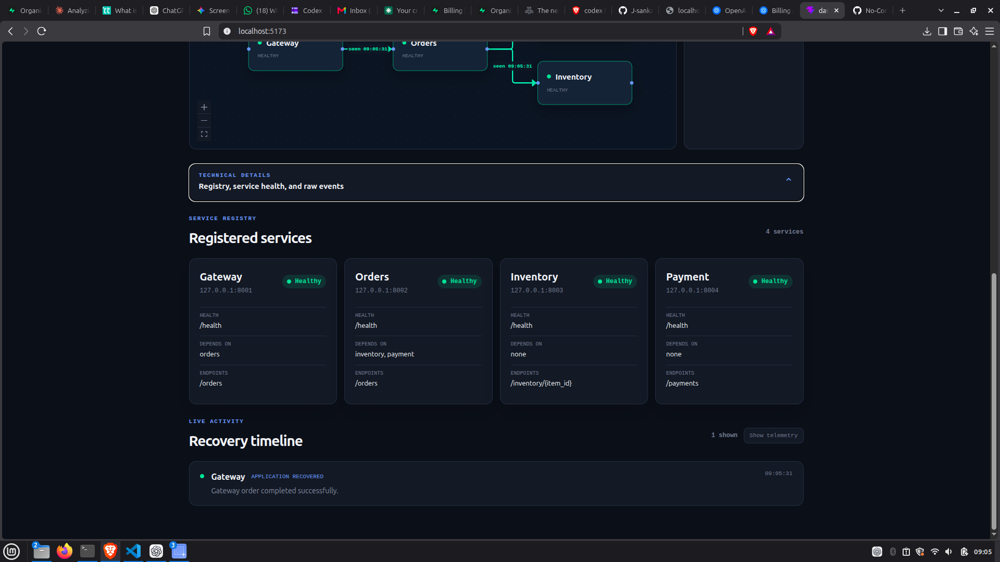
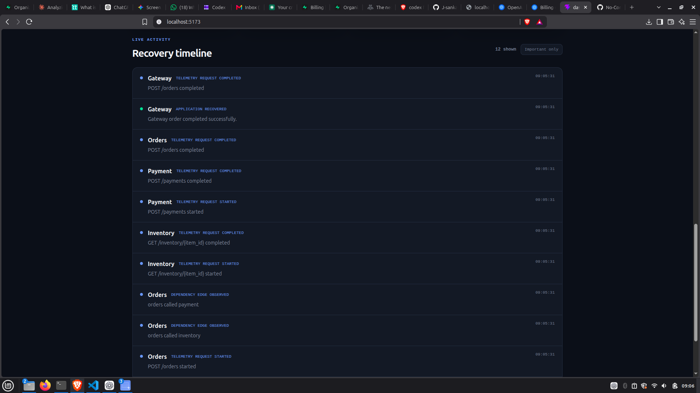
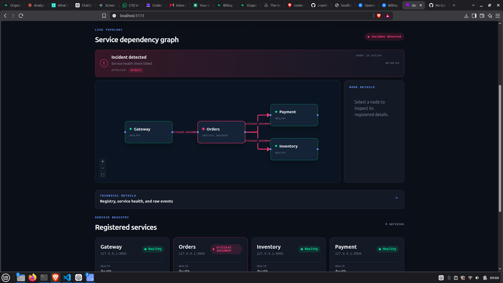
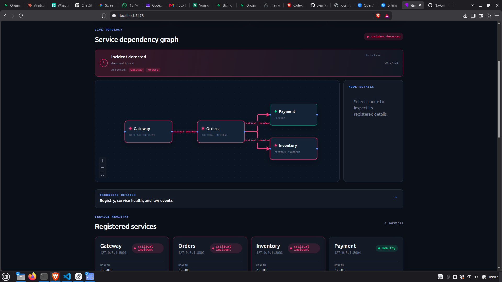
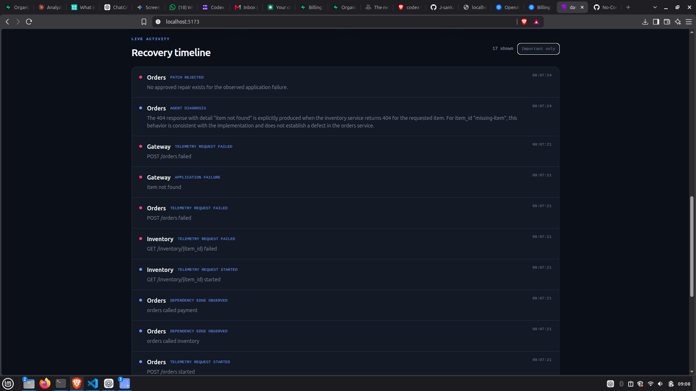

# AutoDeck

## Project Name

AutoDeck - a manifest-driven self-healing service control plane.

AutoDeck is a local demo of an agent-assisted reliability workflow. It observes a small service graph, reports live health and dependency activity, detects application failures, and safely repairs one approved failure scenario without allowing the model to run commands or edit arbitrary files.

This project is submitted to the **Next-Gen Productivity & Automation** track of the Codex Community Hackathon Calicut. The track focuses on using Codex to build agents and tools that automate repetitive work, streamline workflows, and help teams move faster.

## Overview

AutoDeck demonstrates what happens when a service fails during a normal request:

```text
Gateway :8001 -> Orders :8002 -> Inventory :8003
                         \\-> Payment  :8004
```

The application observes this flow through runtime telemetry, publishes structured events through an SSE relay, displays the live service graph in a React dashboard, and uses a guarded diagnosis and recovery pipeline for the seeded Orders failure.

The system is intentionally sized for a local hackathon demo. It is not presented as a production orchestration platform.

## Problem Statement

When a distributed application fails, developers often need to move between terminals, logs, health endpoints, dashboards, and source files to understand what happened. This makes a simple failure difficult to demonstrate, diagnose, and recover from consistently.

For a small team or a local development environment, the repetitive work includes:

- Finding which service is unhealthy or returned an application error.
- Understanding which dependency path was involved in the request.
- Watching a service restart and checking whether it recovered.
- Diagnosing a known source-level defect.
- Applying a safe repair and replaying the original request.
- Keeping the dashboard state synchronized with the recovery lifecycle.

AutoDeck addresses this workflow with a visible, constrained, and repeatable local recovery loop.

## Solution

AutoDeck uses the service manifest as the source of truth for service names, ports, health endpoints, dependencies, entrypoints, and registered source functions.

The runtime flow is:

```text
request
  -> service telemetry
  -> relay event
  -> dashboard topology update
  -> application failure, if any
  -> Watcher B diagnosis
  -> allowlisted patch validation
  -> service restart and health check
  -> one request replay
  -> recovery event and green topology
```

The diagnosis layer may use the OpenAI Responses API, but it is advisory only. The model receives targeted context and returns a structured decision. Local validation remains the final authority for service allowlisting, source-file allowlisting, exact replacement matching, compilation, restart behavior, and replay.

Watcher A handles process and health recovery. Watcher B handles application-failure diagnosis and the approved repair flow. The dashboard keeps routine telemetry available in a technical view while showing a concise incident view for the demo.

## Features

- Four independently runnable FastAPI services: Gateway, Orders, Inventory, and Payment.
- Manifest-driven service registry and telemetry setup.
- Relay API with event history, SSE streaming, and topology data.
- Watcher A for health monitoring and process recovery.
- Watcher B for application-failure diagnosis and controlled repair.
- React dashboard for service health, topology, and recovery events.

## Tech Stack

- **Frontend:** React 19, Vite, React Flow, dagre, CSS
- **Backend:** Python 3.11+, FastAPI, Uvicorn, httpx, Pydantic, uv
- **Database:** None; relay events use a bounded in-memory store
- **APIs / Services:** Local FastAPI services, relay HTTP/SSE API, optional OpenAI Responses API
- **Hosting / Deployment:** Local development; no public deployment currently configured
- **Other Tools:** Codex, `python-dotenv`, Tree-sitter, Git

## Architecture
                         +----------+-----------+
                                    |
                                    v
+-------------+       +------------+------------+       +----------------+
| Gateway     |------>| Orders                  |------>| Inventory      |
| :8001       |       | :8002                   |       | :8003          |
+-------------+       +------------+------------+       +----------------+
                                    |
                                    +-------------------> Payment :8004

Relay :8005       event stream and topology API
Control :8000     registry and telemetry setup API
Watcher A         process and health recovery
Watcher B         application failure diagnosis and repair


The canonical Python package is under `backend/src/backend/`. No duplicate backend package is required or supported outside that `src` layout.

## Codex / OpenAI Usage

Codex and OpenAI tools were used throughout the build for:

- Ideation and architecture planning for the service graph, relay, watchers, registry, and recovery flow.
- Incremental implementation of the backend services and frontend dashboard.
- Debugging process ownership, duplicate watchers, port conflicts, relay restarts, and SSE reconnection behavior.
- Designing the manifest-driven safety boundary for source inspection and patching.
- Integrating structured OpenAI Responses API output for diagnosis decisions.
- Validating model output against a strict schema instead of parsing free-form text.
- Building and refining the live topology and incident-state UI.
- Writing local runtime commands, testing instructions, troubleshooting guidance, and this documentation.

The OpenAI diagnosis agent does not receive arbitrary repository access and does not execute commands. It receives the registered service context, the observed failure, the affected source file, and the original validated request fields. It can return `patch` or `no_repair`; local code decides whether a patch is safe to apply.


### Demo / Pitch Video


https://drive.google.com/file/d/1S16DDdc3gXD-Y97rSO-W1XOMTjCe78Bf/view?usp=drivesdk


Recommended demo sequence:

1. Start the managed runtime and dashboard.
2. Show four healthy nodes and planned dependency edges.
3. Submit a successful order and show the observed edges.
4. Reintroduce the approved Orders boundary bug.
5. Submit the exact-stock order and show the path turn red.
6. Watch diagnosis, patching, restart, replay, and the red -> amber -> green transition.
7. Submit an unsupported `missing-item` request and show that it remains unrepaired rather than receiving an unsafe patch.

## Screenshots















The dashboard includes:

- A live Gateway -> Orders -> Inventory/Payment topology graph.
- Green healthy nodes, amber recovery states, and red failure states.
- A concise incident panel for the latest actionable recovery phase.
- An expandable technical panel containing service registry details and the raw SSE event timeline.
- A topology instrumentation action backed by the control plane on port `8000`.


## How to Run Locally

### Requirements

- Python 3.11 or newer
- [uv](https://docs.astral.sh/uv/)
- Node.js 18 or newer
- npm

### Install

From the repository root:

```bash
cd backend
uv sync

cd ../dashboard
npm install
```

### Configure optional OpenAI diagnosis

Create `backend/.env` if needed. It is ignored by Git:

```env
ORDERS_URL=http://127.0.0.1:8002
INVENTORY_URL=http://127.0.0.1:8003
PAYMENT_URL=http://127.0.0.1:8004
GATEWAY_URL=http://127.0.0.1:8001
AUTODECK_RELAY_URL=http://127.0.0.1:8005
AUTODECK_AGENT_MODE=deterministic
AUTODECK_AUTO_REPAIR=true
AUTODECK_LOG_LEVEL=INFO
```

For model-backed diagnosis:

```env
AUTODECK_AGENT_MODE=openai
OPENAI_API_KEY=your-key-here
OPENAI_MODEL=your-model-name
```

Do not commit API keys or `.env` files. OpenAI mode falls back to deterministic diagnosis when credentials, API calls, or structured output validation fail.

### Start the demo

Open separate terminals and run these commands from `backend/`. Start the relay and control plane first, then the services in dependency order:

```bash
uv run uvicorn backend.relay.main:app --host 127.0.0.1 --port 8005
uv run uvicorn backend.main:app --host 127.0.0.1 --port 8000
uv run uvicorn backend.services.inventory.main:app --host 127.0.0.1 --port 8003
uv run uvicorn backend.services.payment.main:app --host 127.0.0.1 --port 8004
uv run uvicorn backend.services.orders.main:app --host 127.0.0.1 --port 8002
uv run uvicorn backend.services.gateway.main:app --host 127.0.0.1 --port 8001
uv run python -m backend.watcher_a.main
uv run python -m backend.watcher_b.main
```

Start the dashboard in another terminal:

```bash
cd dashboard
npm run dev
```

Open the Vite URL, normally `http://localhost:5173`.

To restart one service, stop its current terminal process and rerun its direct Uvicorn command. For Orders:

```bash
uv run uvicorn backend.services.orders.main:app --host 127.0.0.1 --port 8002
```

Stop each process with `Ctrl+C` in its terminal. Do not use Uvicorn `--reload` for the complete demo. A reload-enabled process watching patched backend files can restart the relay or control plane and interrupt the SSE stream.

### Basic checks

```bash
curl http://127.0.0.1:8001/health
curl http://127.0.0.1:8002/health
curl http://127.0.0.1:8003/health
curl http://127.0.0.1:8004/health
curl http://127.0.0.1:8005/health
curl http://127.0.0.1:8005/topology
```

### Test the demo with Postman

Postman can be used instead of `curl` to demonstrate the complete request and recovery flow.

Create a Postman collection named `AutoDeck Demo` and add these requests.

#### 1. Check service health

Create `GET` requests for:

```text
http://127.0.0.1:8001/health
http://127.0.0.1:8002/health
http://127.0.0.1:8003/health
http://127.0.0.1:8004/health
http://127.0.0.1:8005/health
```

Each service should return HTTP `200` with a healthy status. Also check the current graph:

```text
GET http://127.0.0.1:8005/topology
```

#### 2. Send a successful order

Create:

```text
POST http://127.0.0.1:8001/orders
```

Under **Headers**, add:

```text
Content-Type: application/json
```

Under **Body -> raw -> JSON**, use:

```json
{
  "item_id": "widget",
  "quantity": 2
}
```

The request should return HTTP `200`. This exercises Gateway, Orders, Inventory, and Payment. Return to the dashboard and confirm that the runtime edges become active.

#### 3. Test an unsupported business failure

Reuse the same request with this body:

```json
{
  "item_id": "missing-item",
  "quantity": 1
}
```

Expected result:

```text
HTTP 404 - item not found
```

Watcher B should diagnose this as `no_repair`. It is a valid business error, so AutoDeck must not apply a source patch. The dashboard should not leave this request as an unresolved repair incident.

#### 4. Demonstrate the approved repair

Temporarily reintroduce the seeded Orders defect by changing:

```python
if inventory["quantity"] < order.quantity:
```

to:

```python
if inventory["quantity"] <= order.quantity:
```

Restart Orders using its direct `uv run` command, then send this Postman request:

```json
{
  "item_id": "widget",
  "quantity": 10
}
```

Expected sequence:

```text
HTTP 409
  -> application_failure event
  -> red incident in dashboard
  -> OpenAI or deterministic diagnosis
  -> orange patch/restart state
  -> Orders health recovery
  -> one Gateway replay
  -> HTTP 200 and green graph
```

#### 5. Inspect events in Postman

Add:

```text
GET http://127.0.0.1:8005/events?limit=20
```

This shows the structured event history. To watch live events, use:

```text
GET http://127.0.0.1:8005/events/stream
```

Keep the request open while sending orders from the other Postman tab. The dashboard consumes the same SSE stream.

#### 6. Start the registry flow

To instrument approved service functions, create:

```text
POST http://127.0.0.1:8000/registry/telemetry/setup
```

Then inspect the returned plan and applied files. Refresh the dashboard and submit another successful order to observe the telemetry edges.

Send a successful order:

```bash
curl -i -X POST http://127.0.0.1:8001/orders \
  -H 'content-type: application/json' \
  -d '{"item_id":"widget","quantity":2}'
```

Trigger a valid business failure that should not be patched:

```bash
curl -i -X POST http://127.0.0.1:8001/orders \
  -H 'content-type: application/json' \
  -d '{"item_id":"missing-item","quantity":1}'
```

### Run validation

```bash
cd backend
uv run python -m compileall -q src/backend
uv run python -m backend.tools.validate_manifest

cd ../dashboard
npm run lint
npm run build
```

## Additional Notes

### Demo repair scenario

The first approved repair is the Orders exact-stock boundary bug. The correct check is:

```python
if inventory["quantity"] < order.quantity:
```

Changing it to `<=` incorrectly rejects a request when the requested quantity exactly equals available inventory. With the defect intentionally reintroduced, a request for ten widgets produces the diagnosis and recovery flow:

```text
application failure
  -> red incident
  -> diagnosis and patching
  -> amber recovery state
  -> patch validation
  -> Orders restart and health check
  -> Gateway replay
  -> green recovered path
```

The `missing-item` case is deliberately not patched. It is a valid business error, so the diagnosis returns `no_repair` and the application remains safe.

### Current limitations

- The relay event store is process-local and in-memory; events are lost when the relay restarts.
- The demo runs on one machine and does not provide production process isolation, authentication, or authorization.
- Only the approved Orders repair is implemented.
- Watcher A and Watcher B are separate processes and require the relay to be available for shared live events.
- The dashboard uses SSE rather than a durable event bus or WebSocket transport.
- Recovery state is based on structured events and manifest metadata, not a persistent incident database.
- No public hosting or deployment configuration is included yet.

### Future scope

- Correlate every request across Gateway, Orders, Inventory, and Payment with a durable request ID.
- Derive affected paths dynamically from correlated runtime events instead of relying on demo-level path metadata.
- Add a persistent event store and a shared relay suitable for multiple hosts.
- Add authentication, authorization, audit history, and approval controls for production use.
- Add more allowlisted repair scenarios for Inventory, Payment, and Gateway.
- Add an operator review workflow before automatic patch application.
- Package the runtime with containers and deploy it to a managed environment.
- Add automated integration tests for failure injection, SSE reconnection, watcher recovery, and replay.
- Add richer dashboard filtering, historical incidents, and exportable recovery reports.

AutoDeck’s current goal is a clear, safe, and demoable proof of the recovery workflow. The future scope expands that proof toward a durable multi-service reliability platform without weakening the local safety boundaries demonstrated here.
